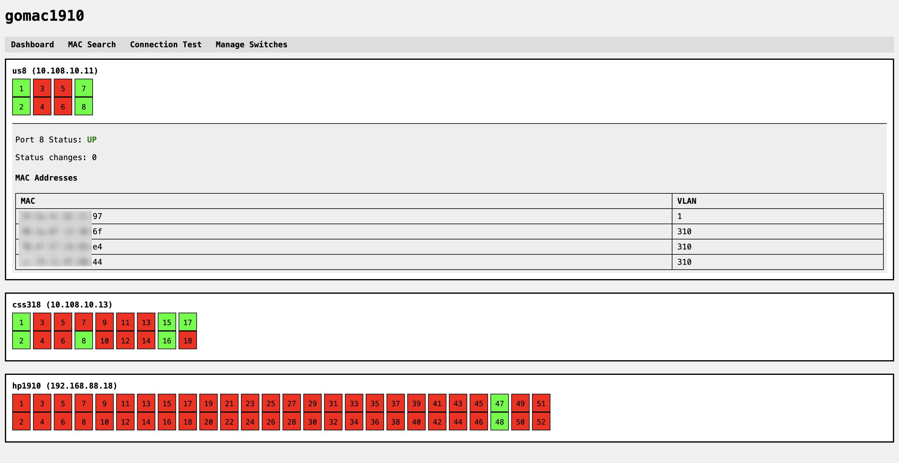
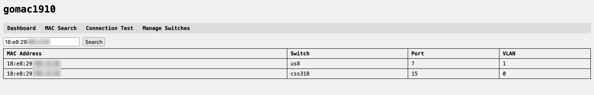
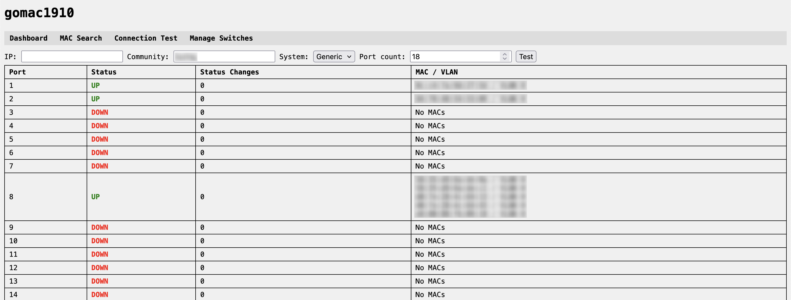
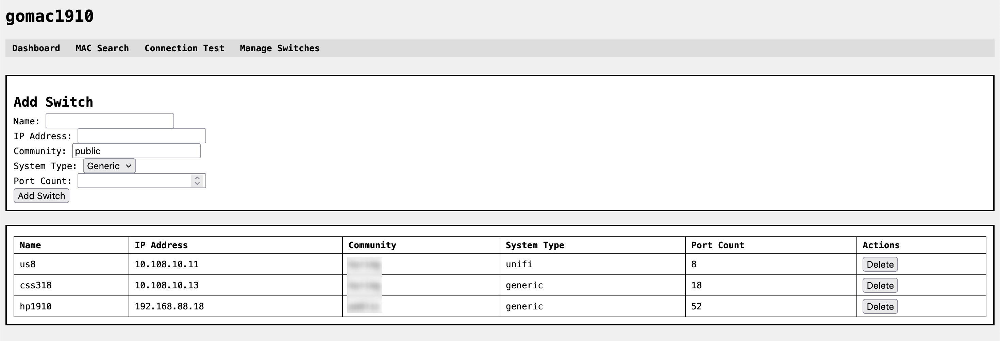

# gomac

> [!IMPORTANT]  
> - There are known limitations for port and mac scan > depends on SNMP OIDS on Switch > needs to be fully rebuild
> - Testing module does not work

---

**gomac** is a lightweight SNMP-based switch monitoring tool written in Go.  
It allows you to monitor switch ports and MAC addresses via a web interface.

The main purpose of go-mac is to help track and document complex or poorly documented enterprise networks, showing which ports are active and what devices are connected to them.

## Features

- Polls switches using SNMP (supports Generic and UniFi systems)
- Tracks port status (`UP` / `DOWN`) and status change count
- Tracks MAC addresses on each port, including VLANs (if supported)
- Web dashboard displaying switches and ports in a "switch front panel" style
- Clickable ports to view detailed status and MAC tables
- Admin interface to add, remove, or edit switches
- MAC search page for finding which switch/port a MAC address is on
- Test page to check SNMP connectivity and table retrieval
- Configurable via `.env` for:
  - Web server port
  - Polling interval
  - Database location

## Additional requirements for compiling on Linux

**Make sure to install current supported go version from golang website directly on to your system.**

```bash
sudo apt update
sudo apt install build-essential libsqlite3-dev
```

When compiling, use this flag:

```bash
su gomac
cd /home/gomac/gomac

go mod tidy

export CGO_ENABLED=1
go build -o gomac ./cmd/server
```

## Linux & systemd

1. Add user

```bash
sudo useradd -r -m -d /home/gomac gomac
```

2. Complete [installation steps](#installation-from-source)

3. Add systemd service

```bash
sudo nano /etc/systemd/system/gomac.service
```

4. Start

```bash
sudo systemctl daemon-reload
sudo systemctl enable gomac
sudo systemctl start gomac
sudo journalctl -u gomac -f 
```

## Installation from source

1. Clone the repository:

```bash
su gomac
cd

git clone https://github.com/AveragePaintEnjoyer/gomac
cd gomac
```

2. Set up .env file (example provided in .env.example):

```bash
WEB_HOST=0.0.0.0
WEB_PORT=8080
POLL_INTERVAL=600
DB_PATH=/home/gomac/gomac/gomac.db
```

3. Build the binary:

```bash
go mod tidy
go build -o gomac ./cmd/server
```

4. Run the server:

```bash
./gomac
```

The web interface will be available at [http://localhost:8080](http://localhost:8080).

## Usage

Dashboard: View all switches, port status, and MAC addresses.



MAC Search: Search for a MAC address to see which switch and port it’s on.



Test: Test SNMP connectivity before adding switches to monitoring.



Admin: Add or remove switches and configure port counts.



## Dependencies

- Go 1.20+
- Fiber web framework
- GORM for SQLite
- GoSNMP for SNMP polling
- Tailwind CSS for UI styling (embedded in HTML templates)